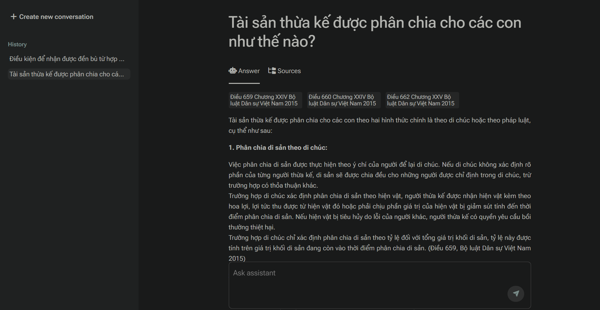
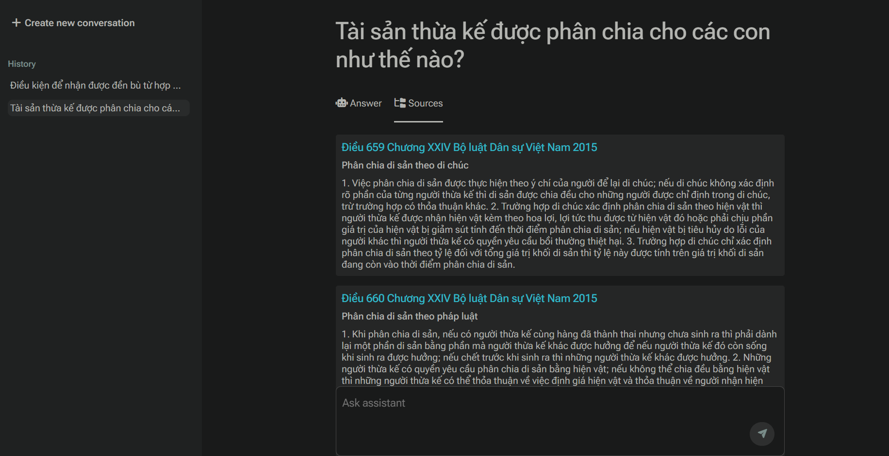
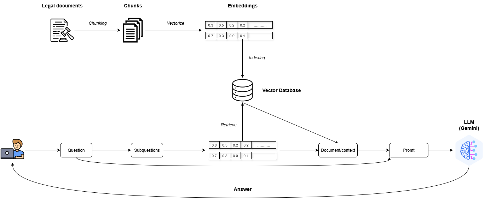

# Law Chatbot Vietnam

> **Trợ lý pháp luật thông minh** sử dụng công nghệ RAG (Retrieval-Augmented Generation) để trả lời các câu hỏi về luật pháp Việt Nam một cách chính xác và có trích dẫn nguồn.

## Tổng quan

Law Chatbot Vietnam là một ứng dụng web thông minh giúp người dùng tra cứu và tìm hiểu các quy định pháp luật Việt Nam. Hệ thống sử dụng công nghệ AI tiên tiến để:

- Trả lời câu hỏi pháp luật bằng tiếng Việt tự nhiên
- Trích dẫn chính xác điều, khoản, chương từ văn bản pháp luật
- Tìm kiếm thông tin pháp luật theo ngữ nghĩa
- Giao diện chat thân thiện và hiện đại
- Lưu trữ lịch sử hội thoại

## Kiến trúc hệ thống

### Thành phần chính:

- **Backend**: Flask REST API
- **AI Engine**: LangChain + Google Gemini 2.5 Flash
- **Vector Database**: ChromaDB
- **Embeddings**: HuggingFace Vietnamese model (`huyydangg/DEk21_hcmute_embedding`)
- **Frontend**: HTML/CSS, Javascript

## Dữ liệu pháp luật

Hiện tại hệ thống đã tích hợp:

- **Bộ luật Dân sự Việt Nam 2015** (686 điều luật)

## Authors

- **Nguyen Minh Trung** - _Initial work_ - [@github](https://github.com/trungbb7)

## Acknowledgments

- [LangChain](https://langchain.com/) - Framework for LLM applications
- [ChromaDB](https://www.trychroma.com/) - Vector database
- [HuggingFace](https://huggingface.co/) - Vietnamese embedding model
- [Google Gemini](https://deepmind.google/technologies/gemini/) - Large Language Model
- Thư viện pháp luật

## Liên hệ

- Email: trungbb8@gmail.com
